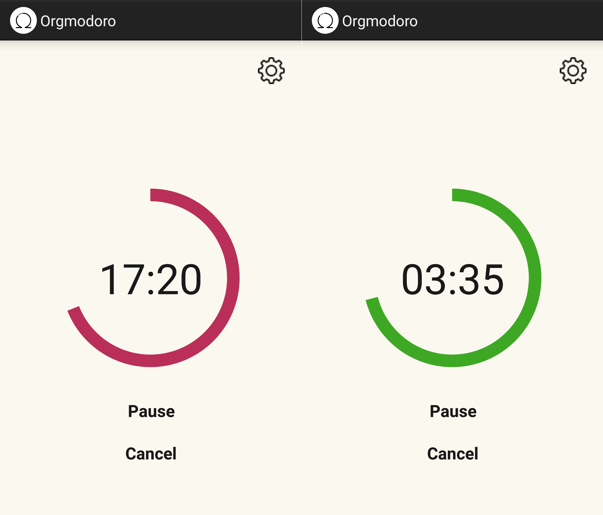
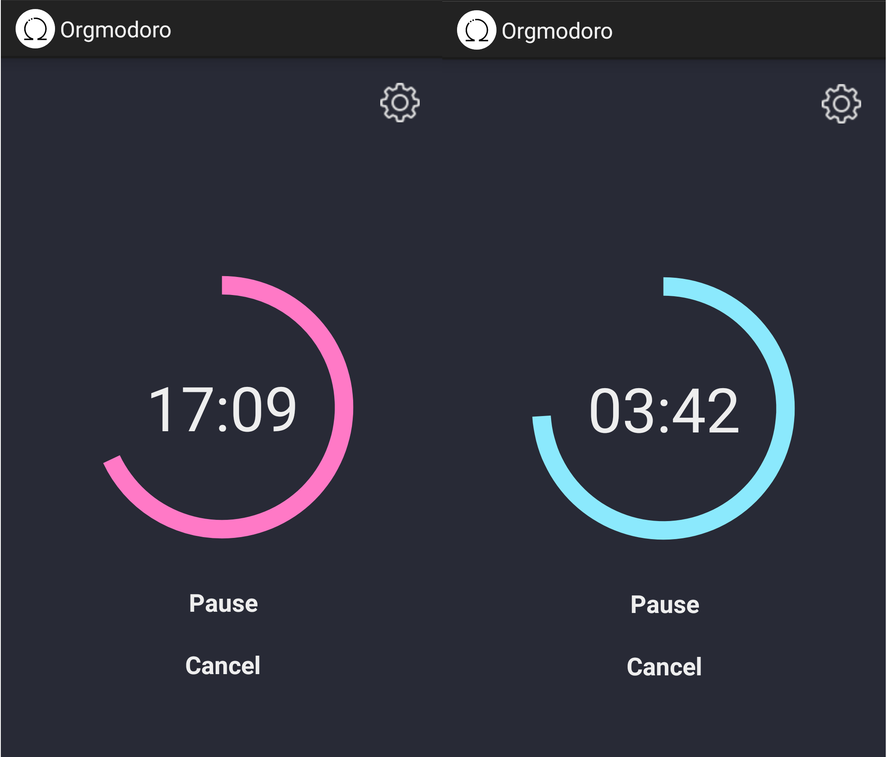
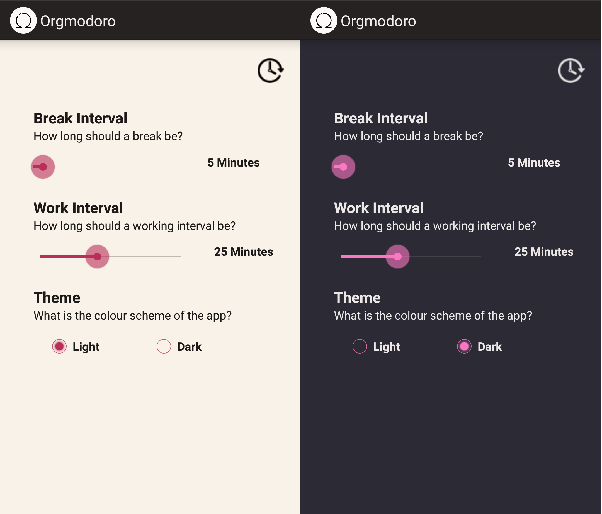

# Orgmodoro
A minimal Pomodoro timer app for android.

# Requirement
Any android phone or tablet using API version 21+ (Latest API version tested on level 27)
- On API version 26+, you may have to manually set the notification channel's importance to urgent. This makes sure the notification pops up.

# Features
- Minimal Pomodoro timer
- Progress bar
- Intuitive controls
- Settings activity
- Customizable Pomodoro timer intervals
- Multiple app colour schemes
- Notifications with resume functionality
- Runs in the background!
- Layout for both tablets and phones!

# Known Bugs
- Countdown timer is not consistent, it may be slower than an actual timer (However, it is accurate enough as a timer).
- singleTask launchMode is used in the manifest, the activity task stack could be broken because multiple activities are used. 
- From time to time, the app may lose its saved variables, and the app may forget what the current time left, the current state, or even the colour theme used. 

# Credits
 - Omega Icon made by Pixelmeetup from www.flaticon.com
 - Settings Icon made by Gregor Cresnar from www.flaticon.com
 - Time Icon made by Freepik from www.flaticon.com
